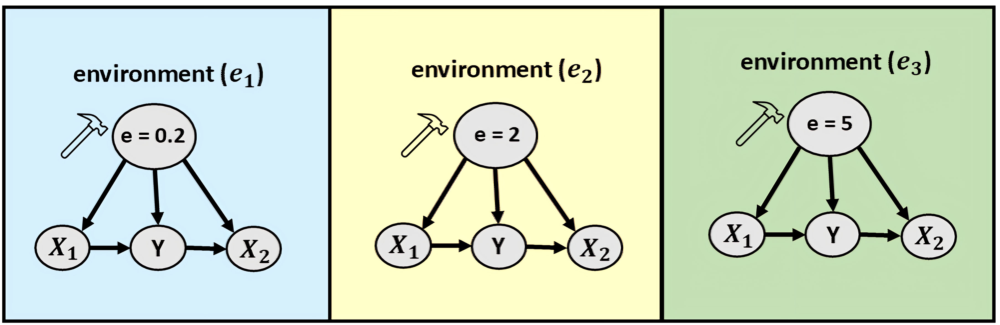
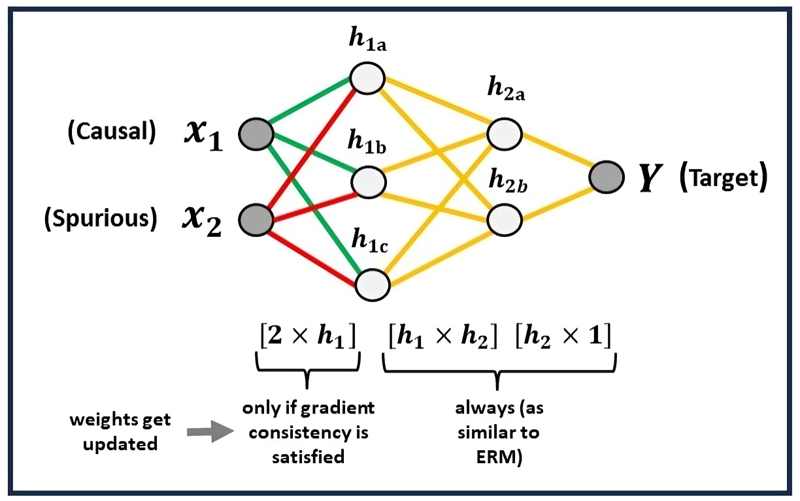
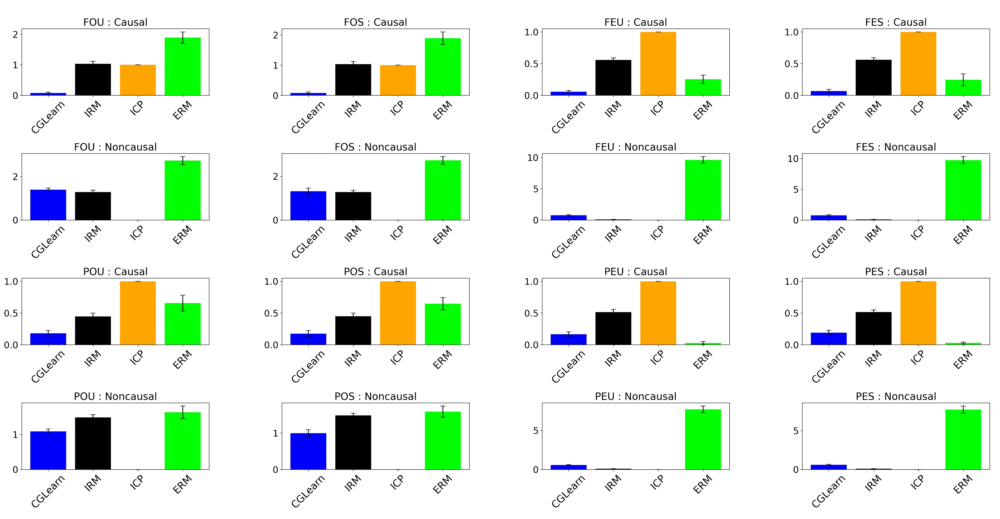

## CGLearn: Consistent Gradient-based Learning for Out-of-Distribution Generalization

This source code is an implementation of the paper - [CGLearn](https://www.scitepress.org/Papers/2025/132604/132604.pdf).

## Key Contributions

1. **Novel Framework for Robust Learning**: We introduce **CGLearn**, a framework that enhances consistency in learning robust predictors by focusing on features that exhibit stable behavior across different environments.
2. **Gradient-Based Invariance Learning**: CGLearn leverages gradient agreement across environments as a reliability signal, ensuring that learned features are less susceptible to spurious correlations.
3. **Applicability to Linear and Nonlinear Models**: We provide both **linear** and **nonlinear** implementations of CGLearn, demonstrating its versatility across various model architectures.
4. **Superior Generalization without Multiple Environments**: Unlike many state-of-the-art methods that require diverse environments for effective generalization, CGLearn achieves high predictive performance even in settings where separate environments are unavailable by utilizing invariance across subsamples.
5. **Comprehensive Empirical Validation**: We validate CGLearn's effectiveness through extensive experiments on **synthetic and real-world datasets**, covering both linear and nonlinear settings, and **regression and classification tasks**.

## Visualizations

1. **Illustration of Multiple Environments and Interventions**  
     
   This figure illustrates **three environments** generated by intervening on variable **e**, which takes distinct values **e = 0.2, e = 2, and e = 5** in environments **e1, e2, and e3**, respectively. In each environment, **X1 is a causal factor** for target variable **Y**, while **X2 is a spurious (non-causal) factor**. This example highlights how different interventions create distinct environments for learning invariant predictors.

2. **Nonlinear MLP Implementation of CGLearn**  
     
   This visualization demonstrates the **nonlinear MLP implementation** of CGLearn. Here, **X1 (causal)** and **X2 (spurious)** feed into the first hidden layer **h1**, where weight updates are performed based on **gradient consistency (using L2-norm)** for each feature across all training environments. The remaining weights, such as those in **h2**, follow a standard empirical risk minimization (ERM) approach.

3. **Performance Comparison in Linear Multiple Environment Setups**  
     
   This figure compares the performance of CGLearn against IRM, ICP, and ERM across various linear multiple environment setups. Each subplot illustrates different data configurations, showing the **mean squared error (MSE)** for **causal and non-causal variables** over 50 trials.

## Files and Folders

- **cglearn_linear.py**: Linear implementation of CGLearn.
- **cglearn_nonlinearMLP.py**: Nonlinear implementation of CGLearn (using Multi-Layer Perceptron).
- **datasets/**: This folder contains two subfolders:
    - **datasets/linear/**: Linearly generated dataset used for demonstration with CGLearn linear implementation (cglearn_linear.py). The dataset follows a structural equation model similar to **Invariant Risk Minimization (IRM)**. [IRM Source Code](https://github.com/facebookresearch/InvariantRiskMinimization). [IRM Paper](https://arxiv.org/abs/1907.02893v1).
    - **datasets/nonlinear/**: Contains the **'Yacht Hydrodynamics'** dataset used for demonstration with the nonlinear implementation (cglearn_nonlinearMLP.py). The dataset is sourced from the [UCI repository](https://archive.ics.uci.edu/dataset/243/yacht+hydrodynamics).

---

For more details, please refer to the full paper: [CGLearn](https://www.scitepress.org/Papers/2025/132604/132604.pdf).
